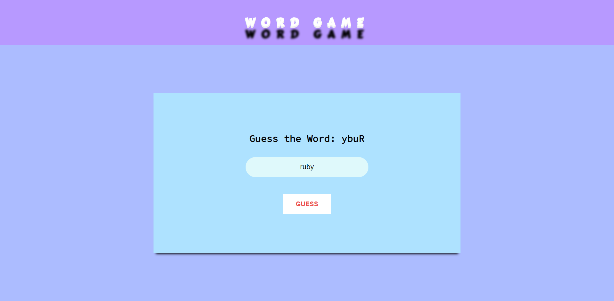

# Scramble Game - Advance JavaScript Project

Welcome to the Scramble Game - an exciting word puzzle built with advanced JavaScript techniques! Test your word-solving skills as you race against the clock to unscramble jumbled words. The game offers a thrilling gameplay experience with increasing levels of difficulty.

## Features

- 🔤 Extensive word database for diverse and engaging gameplay.
- ⏱️ Countdown timer for added challenge (optional feature, disabled in this version).
- 🏆 Score tracking to challenge yourself and compete with friends.
- 🔄 Random word generation for endless replayability.
- 🎮 Intuitive user interface for seamless navigation and gameplay.

## How to Play

1. You will be presented with a scrambled word.
2. Unscramble the letters to form a valid word.
3. Type your answer in the input field and press Enter to check if it's correct.
4. Each correct answer earns you points and advances you to the next level.
5. Enjoy the addictive word-solving adventure!

## Installation

1. Clone the repository:
2. Open `Scramble-Game.html` in your favorite web browser.

## Contributing

Contributions are welcome! If you want to make improvements or add new features, feel free to open a pull request.

## About the Developer

Hi, I'm  Hilal Salarzi (https://github.com/hilalsalarzi), the developer of this project. I'm passionate about web development and enjoy creating fun and interactive projects like this one. If you have any questions or suggestions, feel free to reach out.

---

 Happy coding! 🚀
